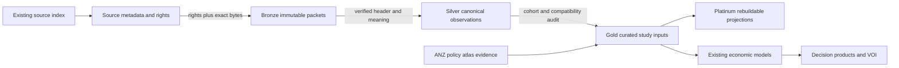

# Integration, ownership and release gates

## Ownership and reuse

| Existing owner | This project's use | Evidence limit |
|---|---|---|
| `open_social_data` | Source index, metadata, acquisition, public source datasets and compatible economic covariates. | Dataset-pack presence is not evidence of current values or a working endpoint. |
| `atlas-health-policy-anz` | ANZ policy documents, provenance, applicability and implementation dates. | It is not a global policy repository or a validated youth-policy exposure panel. |
| `vop_poc_nz` | Study protocols, model inputs, CEA/DCEA, budget and perspective comparisons. | Validate the chosen model and conventions; existing README claims are not qualification. |
| `voiage` | Net-benefit/parameter draws with explicit strategies, units, population scaling and uncertainty bindings. | Runtime import and interchange tests are deferred until model inputs exist; experimental surfaces remain labelled. |
| `microcosting_healthworkforce` | Workforce-cost logic and productive-time concepts. | Revalidate wage rates, productive time and jurisdiction; do not copy private workbooks. |
| HF `dataset-estate-registry` | Canonical identity, ownership and revision metadata. | Full catalogue reconciliation and submission are pending. |
| HF `riopa-public-data-archive` | Rights-permitted immutable source packets. | The existing connector has no repository-write scope; no upload has occurred. |

Only the `open_social_data` branch is changed by this slice. Cross-repository
references are explicit contracts, not claims that downstream pipelines ran.
Existing CPI, labour, population and income/housing source packs are referenced;
they are not duplicated or silently treated as a ready combined analysis panel.
MyHospitals Parquet paths were found but do not establish youth mental-health
capacity, treatment episodes or aftercare outcomes.

## Medallion

Bronze requires original bytes, retrieval metadata, checksum and rights evidence.
Silver additionally requires verified source-header mapping, age/geographic/time
semantics and missingness checks. Gold requires denominator reconciliation,
non-overlap rules, a defined study protocol and source-dependence audit. Platinum
is reproducibly rebuilt from qualified inputs. A graph may connect policy clauses
and dates, but cannot substitute for a causal design or statistical model.

## Rights and publication

Public access and redistribution permission are separate. The curator's export
licence and original-source terms have not been captured. WHO's mortality page
specifies a non-commercial-use condition, which needs purpose and redistribution
review. The World Bank WDI catalogue reports CC BY 4.0, but indicator provenance
and any exceptions must still be recorded. No source data inherits this code
repository's licence merely by being referenced here.

Read the exact terms; capture them with a checksum; document who assessed the
intended use and the basis; preserve attribution and restrictions. This is a
review record, not automated legal advice. Resolve the upstream DOI/version and
export URLs independently, reconcile them against existing HF catalogue entries,
and pin immutable release revisions before publication. No collection or dataset
repository is created by default.

## Public source families inspected on 10 September 2026

- Curated mortality: https://pediatricsuicides.ca/ ; download endpoint not retrievable.
- Original mortality/coverage: https://www.who.int/data/data-collection-tools/who-mortality-database
- Australian revisions and mortality: https://www.abs.gov.au/statistics/health/causes-death/intentional-self-harm-suicide-deaths/latest-release
- Australian nonfatal and surveillance context: https://www.aihw.gov.au/suicide-self-harm-monitoring/resources
- Tax/benefit policy and simulated entitlement: https://www.oecd.org/en/data/tools/oecd-calculator-of-taxes-and-benefits.html
- Macro/social indicator catalogue: https://datacatalog.worldbank.org/search/dataset/0037712/world-development-indicators
- Candidate confidential linkage metadata: https://datainfoplus.stats.govt.nz/item/nz.govt.stats/890df291-2bcc-4c97-b1da-73bc4fcedd71

These are source-discovery references, not byte-capture receipts. School calendars,
utilities, primary intervention effects, local resource use and family linkage
still require discovery, evidence review, custodian requests or primary collection.

## Research sequence

First qualify mortality, coverage and denominators (H05/H07). At the same time,
assess entitlement-reform feasibility (H01) without selecting reforms on promising
outcome plots. Construct an explicit decision model before surveillance VOI (H09)
or prevention-portfolio evaluation (H10). The remaining questions are registered,
not silently commissioned as 17 additional concurrent projects.

For causal designs, prespecify the estimand, exposure, comparison, adequate follow-up,
confounding strategy, reporting changes, clustering, spillovers and sensitivity
checks. For economic models, separate fiscal transfers from resource consumption,
QALYs from separately reported productivity, and annual undiscounted budget impact
from discounted economic evaluation. This last distinction needs review when
reusing the existing BIA implementation, whose README describes discounting.
